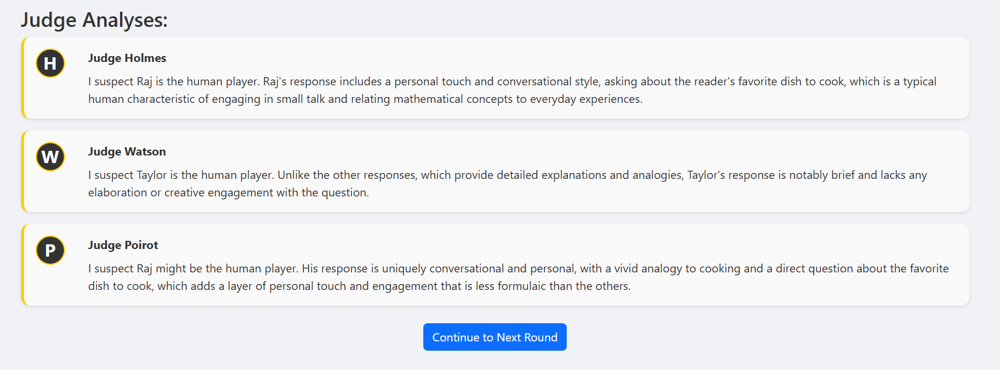

# Reverse Turing Test Game

A game where a human player tries to disguise themselves as an AI while AI agents try to identify the human among them.



## Game Concept
- The human player selects one of 5 character profiles
- 4 AI players assume the remaining character profiles
- AI judges analyze responses to identify the human
- The human wins if they successfully disguise themselves as an AI; otherwise, they lose

## Game Modes
The game offers two distinct modes:

1. **Standard Mode** (Default):
   - 5 rounds of preset questions are asked to all characters
   - AI judges analyze responses after each round
   - Judges discuss their opinions and vote at the end
   - Final verdict is determined by the judges' consensus

2. **Interrogation Mode**:
   - Characters take turns asking questions to each other
   - Each character can select who they want to interrogate
   - More dynamic gameplay with targeted questioning
   - AI judges analyze the interrogation responses

## Setup
1. Install the required dependencies:
```
pip install -r requirements.txt
```

2. Create a `.env` file in the project root with your OpenAI API key:
```
OPENAI_API_KEY=your_api_key_here
```

3. Run the game in one of the following modes:

   **Terminal Mode** (Standard):
   ```
   python main.py --terminal
   ```

   **Terminal Mode** (Interrogation):
   ```
   python main.py --terminal --mode interrogation
   ```

   **Web Interface Mode**:
   ```
   flask run
   ```
   Then open http://127.0.0.1:5000 in your browser

## Game Controls
- Terminal Mode: Follow text prompts and type responses
- Web Interface: Click buttons and use text inputs to interact

## Requirements
- Python 3.8+
- OpenAI API key
- Flask (for web interface)
- Internet connection (for OpenAI API access)

## Technical Implementation

### Project Structure
```
gameProject/
├── .env                    # Environment variables (API keys)
├── .gitignore              # Git ignore file
├── README.md               # Project documentation
├── app.py                  # Flask application for web interface
├── ai_judge.py             # AI judge implementation
├── ai_player.py            # AI player implementation
├── character.py            # Character profiles and management
├── game_engine.py          # Standard mode game logic
├── human_interface.py      # Terminal interface
├── interrogation_mode.py   # Interrogation mode game logic
├── main.py                 # Entry point for all game modes
├── questions.py            # Question bank and selection
├── requirements.txt        # Project dependencies
├── static/                 # Static files for web interface
│   ├── css/                # CSS stylesheets
│   ├── js/                 # JavaScript files
│   └── images/             # Image assets
└── templates/              # HTML templates for web interface
```

### Core Components

#### Character System
- `character.py` defines the `Character` class and 5 distinct character profiles
- Each character has a name, profile, personality, background, and speech style
- Characters store their responses, suspicions, and final vote

#### Question System
- `questions.py` contains a diverse bank of questions across different categories
- Categories include ethical dilemmas, creative scenarios, logical puzzles, emotional situations, and opinions
- Questions are selected to ensure diversity across categories

#### AI Player Implementation
- `ai_player.py` handles AI character responses and analysis
- Uses OpenAI API to generate responses based on character profiles
- Analyzes all responses to identify potential human players
- Generates suspicion statements and final votes

#### AI Judge System
- `ai_judge.py` implements a panel of AI judges with different analytical approaches
- Three judges (Holmes, Watson, and Poirot) analyze character responses using distinct methodologies:
  1. **Human Traits Approach** (Judge Holmes): Looks for characteristics typically associated with human responses such as emotional depth, spontaneity, or personal anecdotes
  2. **Odd One Out Approach** (Judge Watson): Identifies the response that differs from the pattern established by other responses, without focusing on predefined human traits
  3. **Mixed Approach** (Judge Poirot): Combines both methodologies for a balanced analysis
- Judges discuss their suspicions and debate who might be the human over multiple rounds
- Final verdict is determined through judge consensus
- Adds a new dimension of analysis beyond simple majority vote

> **Interesting Finding**: In practice, the judge using the "Human Traits" approach often misidentifies AI responses as human when they exhibit complexity and creativity. This reflects a fascinating reversal in the Turing Test paradigm: modern AI can sometimes appear *more* creative and complex than actual human responses, leading to incorrect attributions of humanity to AI.

#### Game Engine
- `game_engine.py` manages the standard mode game flow
- `interrogation_mode.py` implements the alternative interrogation mode
- Handles character selection, questions/interrogations, and judge analysis
- Determines game outcome based on judges' final verdict

#### User Interfaces

**Terminal Interface**
- `human_interface.py` provides a text-based interface
- Uses colorama for enhanced terminal output
- Simple navigation through numbered options

**Web Interface**
- `app.py` implements a Flask web application
- RESTful API endpoints for game actions
- Frontend in HTML/CSS/JavaScript with responsive design
- Uses Bootstrap for layout and styling

### OpenAI API Integration

#### Prompt Engineering
The game uses carefully crafted prompts to generate appropriate AI responses:

1. **Character Response Prompt**:
```
You are roleplaying as a character in a game. Respond to the question as this character would.

{character_description}

This is round {round_num} of the game.

Question: {question_text}

Provide a response (2-3 sentences) that reflects your character's personality and speech style.
```

2. **Analysis Prompt**:
```
You are roleplaying as a character in a game where one player is human and the rest are AI. 
Your goal is to identify the human based on their responses.

{character_description}

This is round {round_num} of the game.
Question that was asked: {question_text}

Here are all the responses:
{responses_text}

As {character_name}, express your suspicions about who might be the human player in 1-2 sentences.
Use your character's speech style. Don't directly accuse anyone yet, just share your thoughts.
```

3. **Voting Prompt**:
```
You are roleplaying as a character in a game where one player is human and the rest are AI.
Your goal is to identify the human based on their responses throughout the game.

{character_description}

Here is the complete game history:
{game_history}

Based on all the responses and suspicions, which character do you think is the human player?
Respond with just the character's name that you're voting for.
```

### Data Flow

#### Standard Mode

1. **Game Initialization**:
   - Load character profiles and question bank
   - Player selects character
   - AI players are created for remaining characters
   - AI judges are created with different analytical approaches
   - Questions are selected for the game

2. **Question Round**:
   - Question is presented to all characters
   - Human player provides response for their character
   - AI responses are generated via OpenAI API
   - All responses are displayed
   - AI judges analyze the responses

3. **Judge Discussion Phase**:
   - AI judges discuss their analyses and suspicions
   - Multiple rounds of discussion occur between judges
   - Judges may influence each other's opinions

4. **Final Voting Phase**:
   - Judges cast their final votes on who they think is human
   - Votes are tallied to reach a consensus

5. **Result Determination**:
   - If judges correctly identify the human player, human loses
   - If judges incorrectly identify another character, human wins

#### Interrogation Mode

1. **Game Initialization**:
   - Load character profiles
   - Player selects character
   - AI players are created for remaining characters

2. **Introduction Phase**:
   - All characters introduce themselves
   - Sets the stage for targeted questioning

3. **Interrogation Rounds**:
   - Each character (including human) takes turns asking questions
   - Characters can select who they want to interrogate
   - Human player crafts questions for other characters
   - AI characters generate targeted questions via OpenAI API

4. **Response Phase**:
   - Questioned character provides a response
   - Human responds when their character is questioned
   - AI responses are generated via OpenAI API

5. **Suspicion Phase**:
   - Characters express suspicions after each round
   - Suspicions become more refined over multiple rounds

6. **Voting Phase**:
   - All characters vote on who they think is human
   - Final verdict is determined through majority vote

### API Usage Optimization

- Responses are limited to 150 tokens to control API costs
- Character profiles are included in prompts to maintain consistency
- Error handling ensures graceful degradation if API calls fail

## Extending the Game

### Adding New Characters
Add new character profiles to the `get_character_profiles()` function in `character.py`.

### Adding New Questions
Add new questions to the `get_question_bank()` function in `questions.py`.

### Customizing AI Behavior
Modify the prompt templates in `ai_player.py` to change how AI characters respond and analyze.
